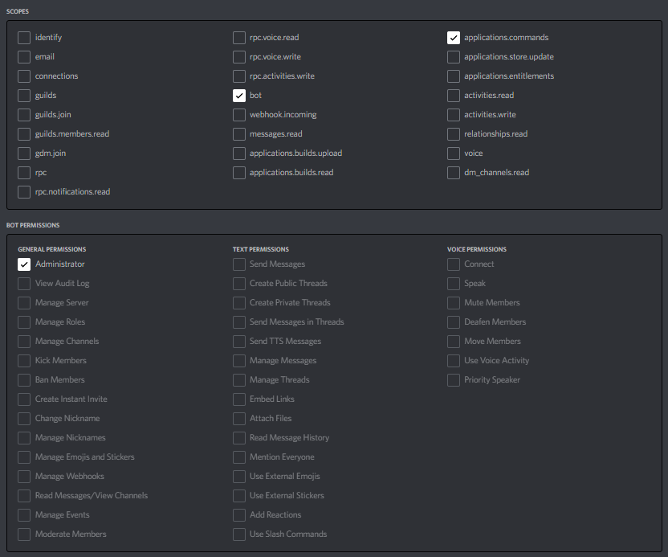

# Longtails

Longtails is focused on one thing, extracting maximum value from long-tail opportunities within Web3. These are not instant profit mechanisms nor are many of them low-effort. Combined though, they create a profit mechanism that can routinely generate funds that are incongruent to the overall effort invested.

**USE AT YOUR OWN RISK. EVERYTHING IS "SAFE" TO USE HOWEVER YOU MAY LOSE MONEY PLAYING ANY OF THE PROVIDED STRATEGIES.**

## Implemented Strategies
  
- [x] Free Mason Stalking
- [x] Cool Cats (Cooltopia) Boss Items (Assymetric Knowledge Frontrunning)
- [ ] 0xSplits Distributor

## Running The System

Longtails has a pretty broad scope and that means you need a few different API keys in order to fully power every piece of the machine.

### Getting The Needed Keys

By getting this core set of keys you will be able to update Longtails as new features are released without needing additional setup.

* To get your keys for [Moralis](https://moralis.io/), pop on over to their webste and login and create an app. 

* To get your keys for Twitter, you need to go to the [Developer Portal](https://developer.twitter.com/en).

* To get your keys for Discord, you need to create a bot and get all the needed tokens from the [Developer Portal](https://discord.com/developers/docs/intro).

### Inviting The Bot

The communication system of Longtails is built on Discord. To get started, head to the Discord Developer portal and create the bot. Make sure that you give the bot permissions to a `bot` and `commands` like so:

When logged in and with your bot created, go to OAuth2 -> URL Generator and select `bot` and `applications.commands` For ease, just give it admin permissions. 

> If you don't trust the usage of it, I recommend going and reading the code.

Just copy and paste the generated url into your browser, and invite the bot your server. With that done, you are ready to proceed.

### Runing In Production

Longtails is designed to easily get up and running. Just click the button below to deploy to Heroku. Then all you have to do is setup the environment variables in the Settings pane.

### Running In Dev

Want to make a few changes or don't want the system running forever? You can also run Longtails locally.

#### Creating `.env`

> Include in `example.env` is the fields you should add to `.env` if you want to run all functions of Longtails. This is the recomended usage as all pieces are built to work on top of each other.

#### Installing Dependencies

`pip install -r requirements.txt`

#### Run The Discord Bot

**For windows:**

`python manage.py shell`
`exec(open('bot.py').read())`

**For mac / linux:**

`python manage.py shell < bot.py`